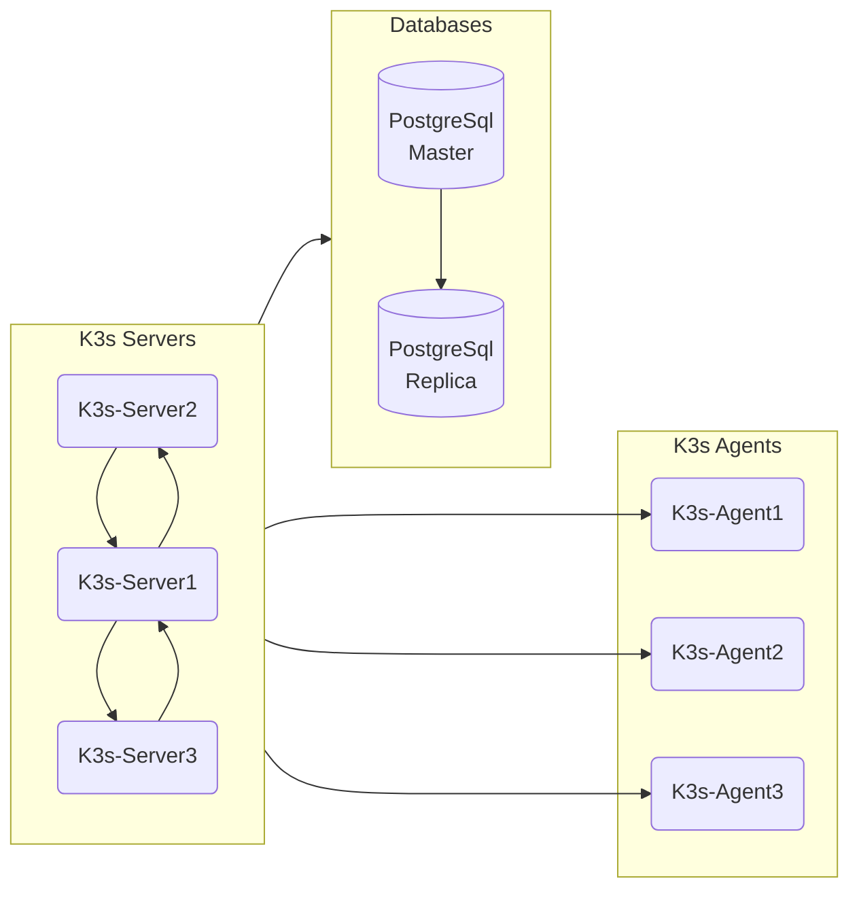

## Requirements

!!! summary "Preperations"

    * [x] A running [Proxmox](/metal/proxmox) instance
    * [x] [Ansible](/metal/asible) installed on client machine
    * [x] [Terraform](/metal/terraform) installed on client machine

## Architecture

